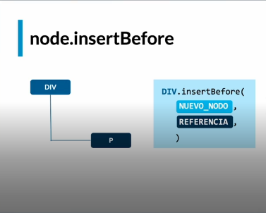
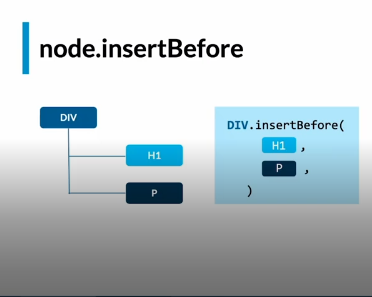
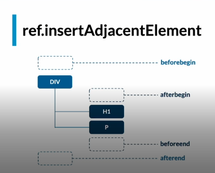

# Crear y Agregar Nodos

## Crear
Se pueden crear nodos de 2 tipos, un elemento o un texto:

* `document.createElement`
* `document.createTextContent`

Ej:

    document.createElement(
    	"div"
    )

> Esta creacion sucede en memoria y se asigna a una variable, no se
> agrega al DOM.

Ej2:

    document.createTextNode( 	
	   "texto" 
    )

## Agregar Nodos
Existen muchisimas formas de agregar nodos al DOM y dependen de las necesidades en especifico.

* `parentElement.appendChild`
* `parentElement.append`
* `parentElement.insertBefore`
* `parentElement.insertAdjacentElement`

`.appendChild` = Siempre agrega un nodo al final

***Despues:***

`.append` = Es la evolución de appendChild.
* Puedes agregar mas de un nodo.
* Puedes agregar Texto.
* IE 11: No soportado. (Internet explorer)

> Si no haces soporte en internet explorer, append, es mejor opcion que appendchild.

`insertBefore` = Permite agregar elementos, antes de la referencia.

> En insert, importa mucho la referencia.

> El hijo de referencia tiene que ser hijo directo del nodo base.

`parentElement.insertAdjacentElement` = De lo metodos mas complicados que existen para agregar un nodo en html.
Sin Embargo es el mas poderoso, y el que mas flexibilidad da, para agregar un nodo.

