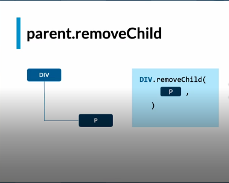
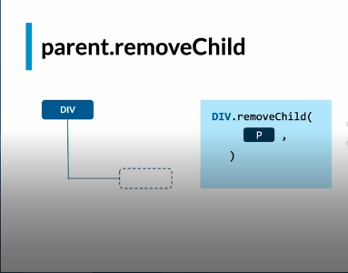
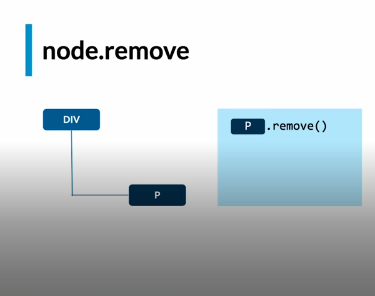
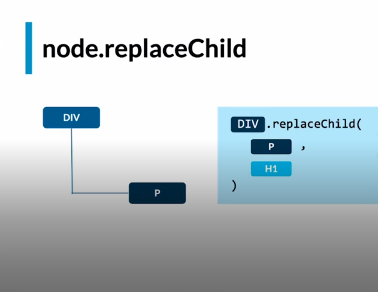

## Eliminar Nodos

* `document.removeChild`
* `document.remove`
* `document.replaceChild`

## document.removeChild

## document.remove
* Es la evolución de `remove.child`
* No pide padres, ni referencias.
* No soportado IE. (Internet Explorer)

## document.replaceChild

